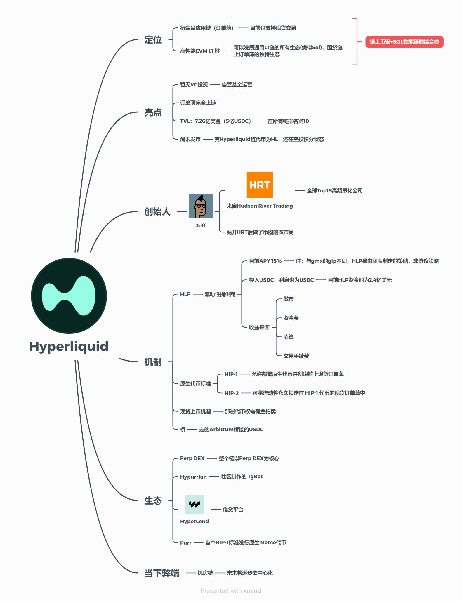

🧐 大秦的梦想｜ Hyperliquid 的“500 万国民”和“闲置荒地”：

如何通过未开发市场和创新生态系统实现突破——

我想起《大秦赋》中一个场景：吕不韦宴请当时尚为布衣的李斯。

甘罗不服，以问试之——

甘：秦灭六国，需兵多少？  
李：100 万足矣。  
甘：秦国民仅 500 万，哪能有 100 万兵？  
李：我看秦国多荒地，只需兴修水利，将荒地开放，吸引六国流民过来耕种，数年即可征得 100 万大军。

很多人做项目，只知道苦苦盯着看得见的存量，常因此陷入瓶颈。

就像认为秦国仅 500 万国民，哪能征得百万兵一样。

而李斯所说的，用闲置资源吸引人口。

以此引申——

你的项目或者生意，那个看起来无法改变的“500 万国民”是什么？那个“闲置的荒地”又是什么？

Hyperliquid 的“500 万国民”可以理解为他早期为数不多的用户基础或市场规模。Hyperliquid 作为一个去中心化永续合约交易平台，初创时可能面临用户数量有限、市场认知度不高等问题。这些现有的用户和市场规模就如同秦国当时的 500 万国民，看起来无法支撑起更大的目标，或者看起来就是痴人说梦；

但是对于 Hyperliquid 而言，他有属于他的“闲置的荒地”

比如 DEX 虽然发展多年，但是永续合约和现货交易，许多新兴市场或小型市场可能没有被大型中心化交易所充分覆盖，大型交易所可能也不会花太多精力在 DEX 上面，但是实际上，区块链的发展，会让大家伙儿对这些市场对去中心化、透明且高效的交易平台有需求。

而且这个需求会越来越大，无法逆转！

前几天纳瓦尔说：

It’s going to take time to transition the world to a decentralized financial system.  
Judging by market cap, we’re less than 5% of the way there.

世界向去中心化的金融体系转变需要时间。  
从市值来看，我们还未达到这一目标的 5%。

向去中心化进化，这是无法改变的事实和规律！

这是多么大的荒地和空间？能理解吗！

Hyperliquid 在这块传统交易平台或其他 DeFi 项目未充分利用的“荒地”上通过构建丝滑的技术体验、强大的社区和生态系统，就像李斯通过兴修水利吸引流民耕种；

流民被什么吸引？

一定是巨大的利益；Hyper 上线的无限拉盘和 Evm 链尚未上线，就创造了如此夸张的财富效应基础上，你难道还愁流民不来？

且 Hyper 的 evm 链生态将与其他链生态完全不一样，因为 hyper evm 链和 hype cex 链是高度集成的，这是史无前例的模式，比如之前链上期权，在 hyper 上就很容易跑通，还有基于 hlp 的流动性借贷 defi 来放大基础收益，都是过去不存在的 defi 玩法；

相当于 hyper 直接把币安搬到 bsc 链，可以与 bsc 链的 defi 直接交互，这啥概念，闻所未闻，所以将会诞生出我们之前从未见过的新型 defi 的创新，两者相互驱动赋能，螺旋起飞；

打破 500 万国民的限制，打造自己的闲置荒地，财富效应和无敌生态吸引流民；

这才是 Hyperliquid 成功的原则——

未来通过建立一个活跃的生态系统，包括开发者支持、社区活动、教育资源等，Hyperliquid 可以将更多的“流民”（即新用户、新开发者）吸引到自己的平台上。

通过教育市场关于 DeFi 的好处，特别是去中心化永续合约的优势，Hyperliquid 可以开拓那些对这一概念还不熟悉但有潜在需求的市场。

所以他根本不是在和现在有的 DEX 在竞争，他是在和币安等 CEX 竞争——

我们不能对任何新兴事物存在偏见，我们需要去寻找分歧更大的地方，去看到每个项目的“500 万国民”和可能的“闲置荒地”！

