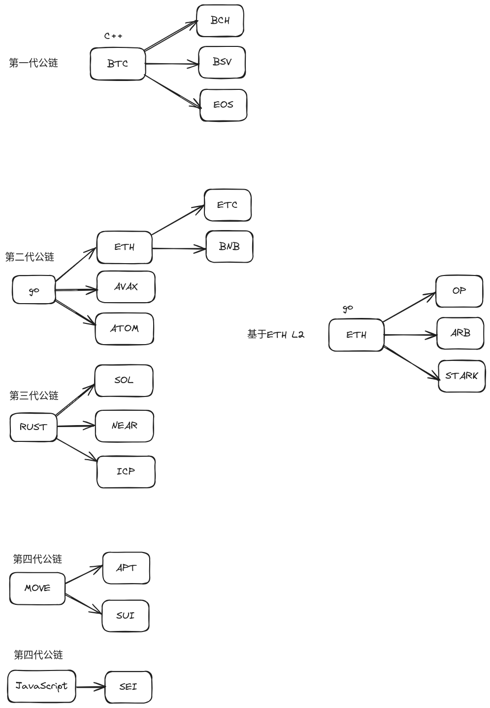

# crypto-airdrop
基于starknet空投资格，现创建一个世界级项目，用于领取后面项目的空投资格。

Based on the starknet air investment qualification, a world-class project is now created to receive the air investment qualification for subsequent projects.

# 共建空投资格
做大做强，大家star起来，把项目顶到5000，共同富裕。

# 抹茶交易所
- [阳光普照](理财)
```
注册链接：https://www.mexc.com/register?inviteCode=1K9Bo
```

# 其他板块

- [区块链新闻](https://github.com/fundgao/crypto-airdrop/tree/main/crypto-news)

- [区块链新项目](https://github.com/fundgao/crypto-airdrop/tree/main/crypto-new-project)



# 技术基础

C++ -> GO -> RUST -> MOVE | JavaScript


# 工具网站
- [Messari](https://messari.io/research) 高质量研报
- [Ave](https://ave.ai) 查看 Token 相关信息
- [Defillama](https://defillama.com) 查看总质押量TVL
```
专注于去中心化金融(DeFi)项目的数据,为用户提供全面的 DeFi 资产和协议分析。
基本上有名的 DeFi 协议和项目都可以在这个网站上查询到,对于数据指标的分析十分有用。
```
- [Dune](https://dune.com/home)
```
通过自定义查询和可视化,允许用户深入分析链上数据,是数据科学家和分析师的首选工具。
```
- [arkham](https://www.arkhamintelligence.com/)
```
提供了一系列高级链上分析功能,帮助用户跟踪资金流动和识别市场趋势。
在本次的比特币 ETF 热潮中,Arkham 识别和记录了各大ETF持有比特币的数量,
比例和流入流出,从而给价格预测提供了一个良好的角度。
```

# World Coin

$WLD to the moon

## 老公链 L1
- SOL
- AVAX
- MATIC
- ADA
- NEAR
- ATOM


## 牛市末日战车
- BCH
- ETC
- EOS
- BSV


## 新高性能公链 L1
- APT
- SUI
- SEI


## AI 板块
- WLD
- RNDR
- ARKM
- FET


## BRC20 铭文
- ORDI
- RATS
- SATS


## 破产板块 & 监狱板块
- LUNA
- LUNC
- USTC
- FTT
- FTM


## Meme
- DOGE
- SHIB
- PEPE
- TROLL
- FLOKI
- GROK


## 粉丝币板块
- CHZ
- SANTOS
- BAR
- PSG
- LAZIO


## 游戏板块
- YGG
- AXS
- GALA
- SAND
- MANA


## RWA板块
- ONDO
- POLYX


