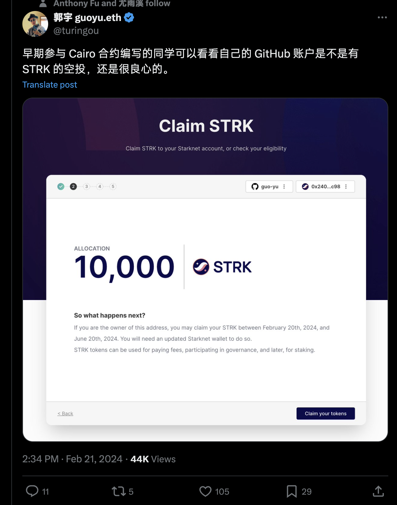

# crypto-airdrop
基于starknet空投资格，现创建一个世界级项目，用于领取后面项目的空投资格。
Based on the starknet air investment qualification, a world-class project is now created to receive the air investment qualification for subsequent projects.

# 共建空投资格
做大做强，大家star起来，把项目顶到5000，共同富裕。

# 区块链新闻

## 2022年12月12日 SBF在巴哈马被捕- 美国金融监管方正式起诉

## 2023年11月22日 币安CEO赵长鹏对洗钱指控认罪，公司被罚43亿美元

## 2024年2月16日 OpenAI发布文生视频大模型Sora

## 2024年2月21日 GitHub 用户来领空投： TOP 5k 项目的贡献者可领取价值 $200 空投

