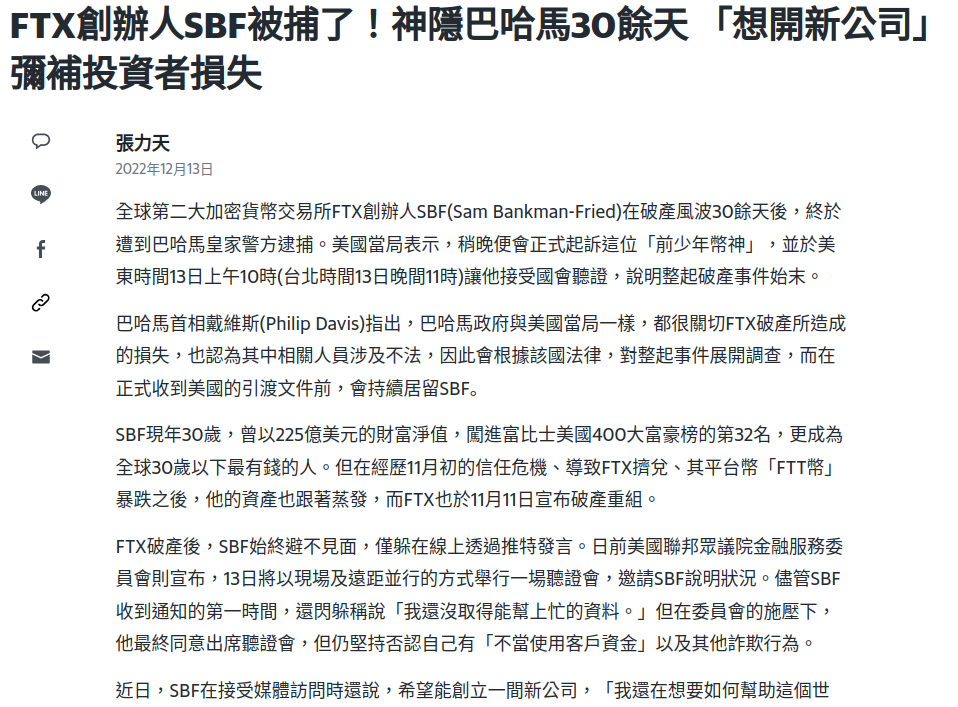
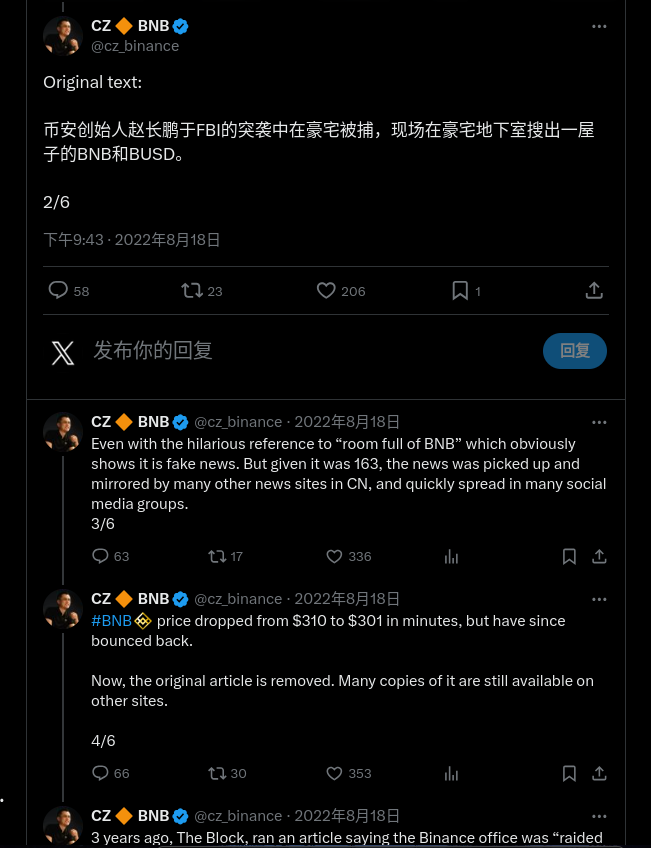
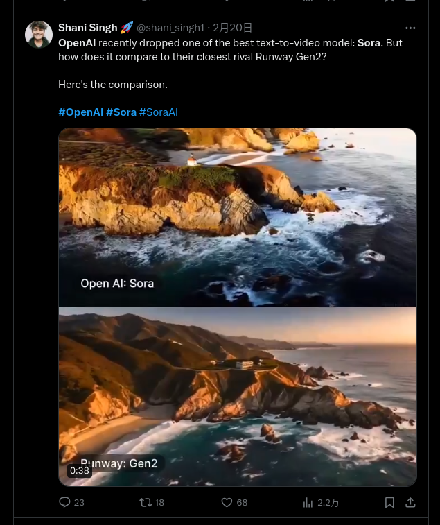
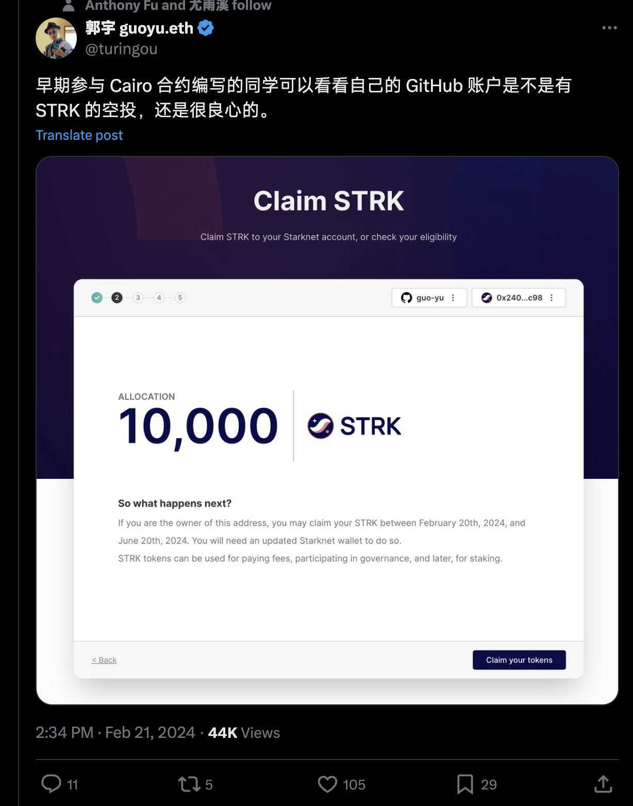

# 区块链新闻

## 2022年12月12日 SBF在巴哈马被捕- 美国金融监管方正式起诉



## 2023年11月22日 币安CEO赵长鹏对洗钱指控认罪，公司被罚43亿美元



## 2024年2月16日 OpenAI发布文生视频大模型Sora



## 2024年2月21日 GitHub 用户来领空投： TOP 5k 项目的贡献者可领取价值 $200 空投



2024.3.21币圈大事件🌍
```
•Solana 生态预售 Meme 币项目 SMOL 今日上午11点上线

•OpenAI预计年中推出性能更强的GPT-5

•鲍威尔发言传递鸽派信息，确认利率已达高点

•XAI 将与 The MIX 合作，计划在 2024 年底前将 100 款游戏引入 Xai Web3 生态系统

• 贝莱德在以太坊网络上推出“贝莱德美元机构数字流动性基金（BUIDL）”——此消息传出后，RWA 板块正在上涨。

• Coinbase 已宣布$RONIN上市。

• Coinbase 国际交易所将于 4 月 1 日开始开始$DOGE $LTC $BCH期货交易。

• 币安将于 4 月 4 日退市$DREP $MOB $PNT 。

• $AEVO - Aevo 推出了交易和质押激励计划。

• $GALA - Gala games 宣布“Project Cerberus”移动原型即将推出。

• $LINA - Linear Finance 的多重抵押品功能即将推出。

• $NAKA - Nakamoto Games 将于 3 月 22 日在 Bybit 上市。

• $SUI - Mysten Labs 在 Sui 上推出了 Pilotfish（自动缩放技术）。

• $SLERF - Arthur Hayes 推广 memecoin $SLERF 。

• $STRK - Starknet 宣布了 2024 年路线图，并计划在第二季度实施并行化。

• $TON - TON 基金会启动 1.15 亿美元的社区奖励计划。

•$PORTAL-跨链游戏平台 Portal 将开放质押并即将宣布首个 Launchpad 合作伙伴
```
