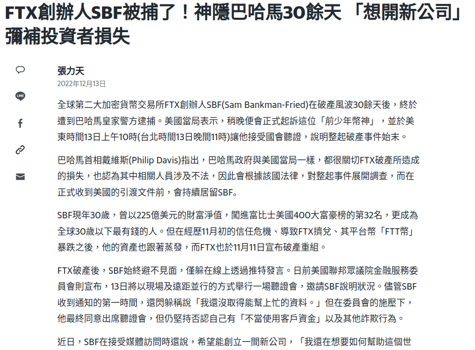
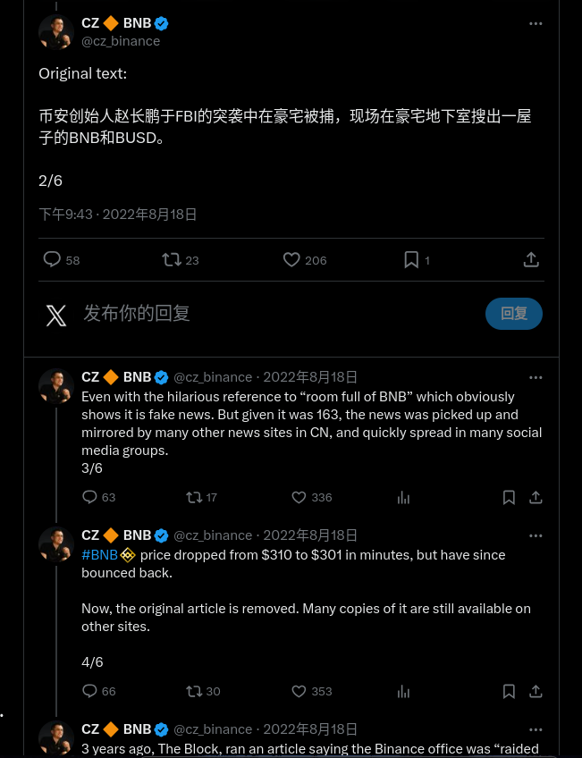
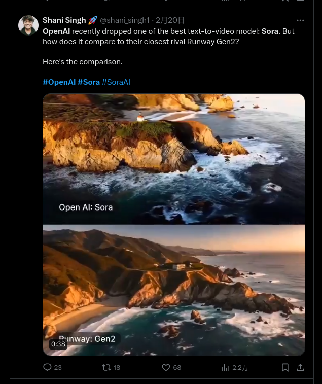
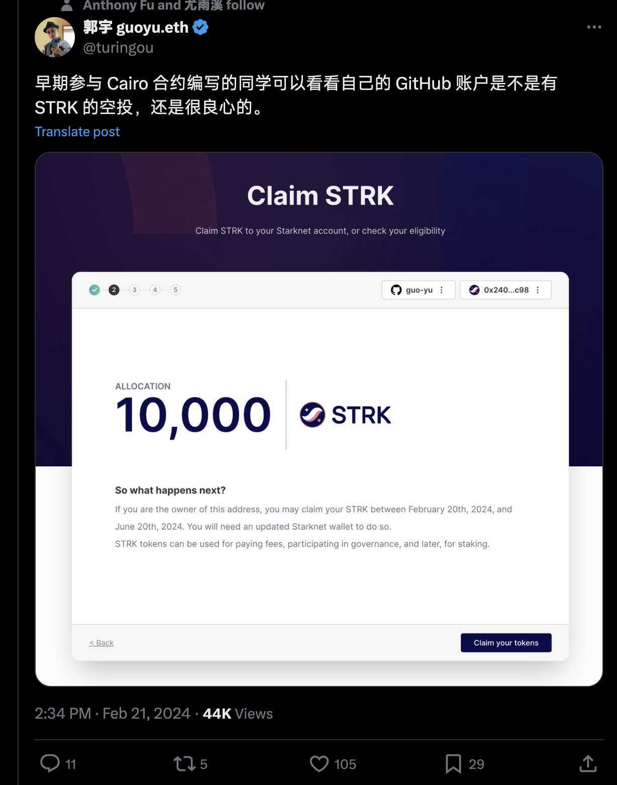

# 区块链新闻

## 2022年12月12日 SBF在巴哈马被捕- 美国金融监管方正式起诉



## 2023年11月22日 币安CEO赵长鹏对洗钱指控认罪，公司被罚43亿美元



## 2024年2月16日 OpenAI发布文生视频大模型Sora



## 2024年2月21日 GitHub 用户来领空投： TOP 5k 项目的贡献者可领取价值 $200 空投



2024.3.21币圈大事件🌍
```
•Solana 生态预售 Meme 币项目 SMOL 今日上午11点上线

•OpenAI预计年中推出性能更强的GPT-5

•鲍威尔发言传递鸽派信息，确认利率已达高点

•XAI 将与 The MIX 合作，计划在 2024 年底前将 100 款游戏引入 Xai Web3 生态系统

• 贝莱德在以太坊网络上推出“贝莱德美元机构数字流动性基金（BUIDL）”——此消息传出后，RWA 板块正在上涨。

• Coinbase 已宣布$RONIN上市。

• Coinbase 国际交易所将于 4 月 1 日开始开始$DOGE $LTC $BCH期货交易。

• 币安将于 4 月 4 日退市$DREP $MOB $PNT 。

• $AEVO - Aevo 推出了交易和质押激励计划。

• $GALA - Gala games 宣布“Project Cerberus”移动原型即将推出。

• $LINA - Linear Finance 的多重抵押品功能即将推出。

• $NAKA - Nakamoto Games 将于 3 月 22 日在 Bybit 上市。

• $SUI - Mysten Labs 在 Sui 上推出了 Pilotfish（自动缩放技术）。

• $SLERF - Arthur Hayes 推广 memecoin $SLERF 。

• $STRK - Starknet 宣布了 2024 年路线图，并计划在第二季度实施并行化。

• $TON - TON 基金会启动 1.15 亿美元的社区奖励计划。

•$PORTAL-跨链游戏平台 Portal 将开放质押并即将宣布首个 Launchpad 合作伙伴
```

2024.3.25
```
总结一下4🈷份利好的币种
方便大家提前布局，起飞之前埋伏好

● $DOGE
- Coinbase International 将于 4 月 1 日推出$DOGE期货交易。
- 4 月 20 日被称为“总督日”。
- 重要的是要考虑最近模因币价格对此类事件做出敏感反应的趋势。

● $APT
- Aptos 准备在 4 月份发布重要的 RWA 公告。
- 与一家主要资产管理公司的潜在合作传闻。 （贝莱德/富兰克林邓普顿）
- 我预计详细信息将在 4 月 2 日的“Aptos DeFi DAYS”活动中公布。

● $PENDLE
- 据 Arthur Hayes 称，4 月中旬可能会推出 EigenLayer 代币。
- $ETHFI的成功推出 - 带来超过两倍的回报 - 使 Pendle Finance 产品重新受到关注。
- 即将推出的 Restake 项目的代币发行可能会提振 Pendle Finance 的势头。

● $FTM
- Fantom Sonic 主网预计将于 3 月底至 4 月初推出。
- 首席执行官 Andre Cronje 积极参与促销活动。
- 虽然价格可能已经反映了预期的催化剂，但由于 Andre Cronje 的重大影响力，战略考虑是必要的。

● $STX
- 距离比特币减半还有不到一个月的时间。
- Nakamoto 升级计划于四月底进行。
- Stacks 被认为是第一个符合 SEC 标准的区块链，它继续吸引富兰克林邓普顿等全球资产管理公司的兴趣。

● $ONDO
- 贝莱德宣布推出 1 亿美元的代币化资产基金。
- Ondo Finance 是目前与贝莱德关系最密切的 RWA 项目。
- 在 Bitwise 的“2024 年加密用例”报告中被提及为关键项目。 （潜在的其他机构伙伴关系）

● $TON
- Telegram 决定专门使用$TON进行广告支付，这意味着每月将涌入 8 亿活跃用户。
- Telegram 拥有“潜在 IPO”催化剂。
- TON 基金会的公开联赛于 4 月 1 日开始，向 TON 生态系统中的项目和用户分发 3000 万$TON 。

● $XPLA
- 有传言称 zkSync 将于四月推出。
- XPLA 最近获得了 Matter Labs 的投资。 （可能是 zkSync 测试版）
- XPLA 已上线 AAA 游戏“MadWorld”，并计划很快再上线两款 AAA 游戏。

● $AERO
- 基础连锁店的 TVL 在一个月内翻了一番。
- Aerodrome 是 Base 链上领先的 DeFi，可能充当 Base-beta 版。
- Aerodrome 计划在几周内推出 Slipstream。
- Coinbase Ventures 去年 2 月正式宣布收购并持有$AERO 。
```

2024-03-26
```
昨晚我就看情况不对劲，随即我用布林带、macd、均线组、迪马克序列、vpvr指标进行了缜密的分析，
对美联储和各国央行政策进行了深入理解和解读，
并通过缠论、波浪、维斯特螺旋、斐波那契等交易法做出了严谨测算后，
终于刚才又tm爆仓了
```

2024-03-27
```
本周五将迎来史上最大季度交割，BTC和ETH
期权总交割金额超150亿美元
• 香港或采用与美国相反方式创建实物比特币ETF
• 南美最大的黄金矿商 Nilam Resources将购买
24000枚比特币-（价值17亿美元）
• 苹果将于6月在线举行全球开发者大会，重点关注人工智能
• MoveVM正在赢得区块链开发商和市场的青
A*. $APT $SUI
• Coinbase Assets 今天已将 Shadow Token
（SHDW）和 Neon EVM （NEON）添加到其路线图中。
• Siacoin $SC将于今天在 Bithumb 上市。
• EigenLayer 已先于主网在 Holesky 上启动了测试网的最后阶段。$ETHFI $ALT
• $ANKR- Ankr 推出了 Layer 1 Neura，这是一个专注于人工智能的区块链。
• $ALEX - ALEX 在由 Spartan 领投的最新一轮融资中获得了1000万美元。
•$INJ - Injective 正在发布对Injective Bridge 的离子升级。
• $ILV - Illvium 在A 轮融资中筹集了 1200万美元
```

2024-03-28
```
首先我没破防，就是我有个朋友是这样的。
他就和你说的一样，但他不是那样的。
我觉得你这样真的没意思，你就算发了他们也不会破防。
因为我朋友是这样的所以我知道，我劝你最好删了。
因为我朋友就算看了也不会破防，所以你这句话留着也没啥用，还不如删了。
然后就是我没破防，只是我朋友是那样的。
我提替我朋友说话，我没破防，我就是提醒一下你。
记得把这句话删了，我可没破防。
```

2024-04-02
```
你知道你为什么天天炒币还没发财吗？
不管是现货合约，还是铭文NFT，都是有窍门的。
下面传授给你们9条最有效的交易口诀，偷偷地学，不要外传！

1，买横买坑不买竖，卖点就在鼎沸处；
2，连续小涨是真涨，连续大涨要离场；
3，大幅冲高要回踩，不挖深坑不大买；
4，主升加速要见顶，急跌急卖缓涨缓卖；
5，急跌无量是恐吓，缓跌放量赶紧撤；
6，价格突破生命线，不要犹豫做波段；
7，日线月线认真看，跟着主力把仓建；
8，币价上攻没有量，主力诱多别站岗；
9，缩量新低是底像，增量回升要进场。
```

2024-04-03
```
2024年美联储议息时间表（北京时间）：
1、2024年2月1日，利率决议；
2、2024年3月21日，利率决议+经济展望；
3、2024年5月2日，利率决议；
4、2024年6月13日，利率决议+经济展望；（市场中性假设：第一次降息）
5、2024年8月1日，利率决议；
6、2024年9月19日，利率决议+经济展望；
7、2024年11月8日，利率决议；
8、2024年12月19日，利率决议+经济展望。（市场中性假设：第二次降息）
此外，美国大选是11月5日。
```

2024-04-11
```
#接龙 
1. https://twitter.com/FomoBase
BASE预售 1小时  15M$ ，很多老外冲，盯开盘能吃肉，提前准备好BASE钱包

2. 符文元宇宙 runse verse 明晚可以打
https://twitter.com/GenifyHQ

3.符文黑曜石，0.0015BTCmint价格，晚上21点公售，布偶背景
https://inscribenow.io/collections/632335884d6230e3

4.INKs ，0.0005 BTC 晚上22点白名单，23点ink持有者，24点公售
https://ordinalgenesis.xyz/mint/7623f930474e2044

5.大猩猩，免费 23点白名单，1点公售
https://magiceden.io/ordinals/launchpad/runesterminal
https://ordzaar.com/marketplace/collections/apeodyssey/mints

6.大理石，0.015 BTC，24点白名单（符石持有者就是白，1点30公售）数量少可以无脑上
https://magiceden.io/ordinals/launchpad/theblockcollection

7.12号凌晨6点开盘，base上热度很高的青蛙猴
https://twitter.com/moonthepoon

8.punk的新填表项目
https://twitter.com/RunesPunks/status/1778185353075302801

9.留bsc地址
https://twitter.com/hodlstrong_/status/1778111860014981267
```

2024-04-12
```
4.12梭哈晨报：

1. $btc 继续上下震荡，直接磨死了一大批山寨，山寨继续阴跌中；

2. JPMorgan 表示，“低迷” 的加密货币风险投资构成下行风险；

3. $TON 的市值反超 $DOGE ；

4.Craig Wright 放弃对挪威 Hodlonaut 的上诉；

5.Chainlink 推出跨链代币传输应用 Transporter，支持以太坊等多个区块链 ；

6.Coinbase 将于 4 月 18 日上线 Pepe 永续期货合约；

7.
@1intro
  将于 4 月 14 日进行 INTRO LBP 公开发售，40% INTRO 总供应量将分配给生态系统 / 激励措施；

8.Arkham 平台已支持用户监控 NYDIG 关联地址；

9.Omni Network 公布其 300 万枚 OMNI 创世空投详情，代币总供应量为 1 亿枚；

10.Olive Network 与 CoinList 合作推出 “Olive Staking Saga” 奖励活动，将分发 15 亿 OLIVE 代币；

11. Circle 推出了一种交易 BlackRock 代币化基金股份以换取 USDC 的方式；

12.4 月 Base NFT 交易量逼近 2,800 万美元，创下月度新高；

Base上的NFT持续火热中，只是无门入的人永远找不到入口；

13.#bitcoinnft 急需狂暴，freemint完的立马能卖0.07btc的比比皆是，你永远不知道谁在买；

14.美国 3 月 PPI 年率录得 2.1%，为 2023 年 4 月以来新高；
```


