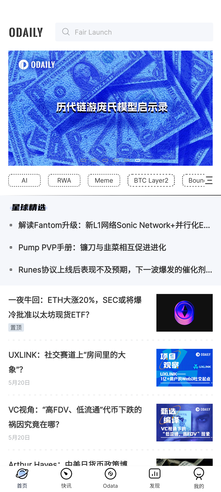

# 区块链启示录

## 工具篇

### 资讯

### 交易所
二级市场

- 币安 binance - 世界顶级交易所  
  注册[https://www.mexc.com/register?inviteCode=1K9Bo](https://www.mexc.com/register?inviteCode=1K9Bo)

  meme币的终点

  有质押、赚币、理财  
  

- 抹茶 mexc - 二线交易所  
  注册[https://www.mexc.com/register?inviteCode=1K9Bo](https://www.mexc.com/register?inviteCode=1K9Bo)

  meme币的起点

  阳光普照 - 年化率 80%

  

### 钱包
一级市场

- [TokenPocket](https://www.tokenpocket.pro/)  

创建钱包，选择钱包网络  

保存助记词  

- [ave](https://ave.ai/)  

ave界面  

ave交易  

### 钱币风险  
- 钱包授权
- 恶意空投代币
- 貔貅盘
- 恶意软件读取粘贴盘板 - 复制私钥时
- 恶意软件读取本地文件 - 钱包保存私钥时
- 助记词截图：微信传输被盗取、网盘上传被盗取
- 滑点太高被夹

### 去中心化交易所
- uniswap
- cake

### 入金、出金、转账、提现、质押
- 入金，筛选购买金额、转账方式、汇率、可靠的商家  

- 入金成功后，划转资金，进行币币交易  

- 转账 & 提现到钱包或其他交易所  

选择网络    

输入接收地址。网络要一致  

### 币圈名词  
- KYC：身份认证
- 土狗、空气币、meme
- 山寨：非 BTC ETH 的主流币、价值币
- 大饼：BTC
- 二饼：ETH
- 跑单：送外卖，币圈最终归宿
- 归零：币圈最终归宿
- DeFi：
- GameFi
- NFT
- FUD
- RUG
- Fomo
- Mint

